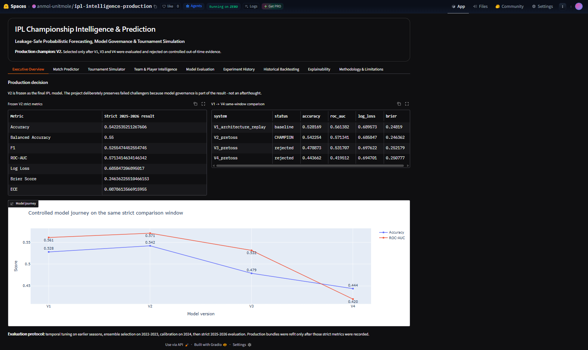
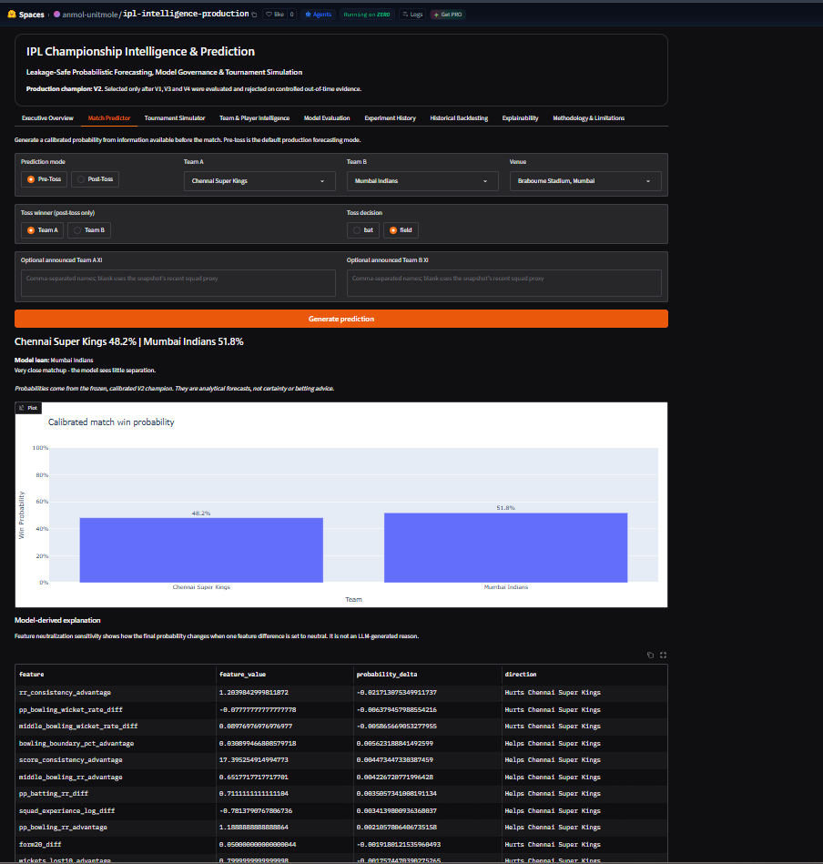
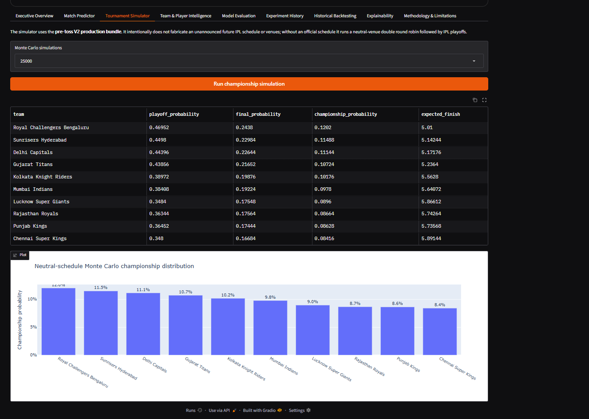
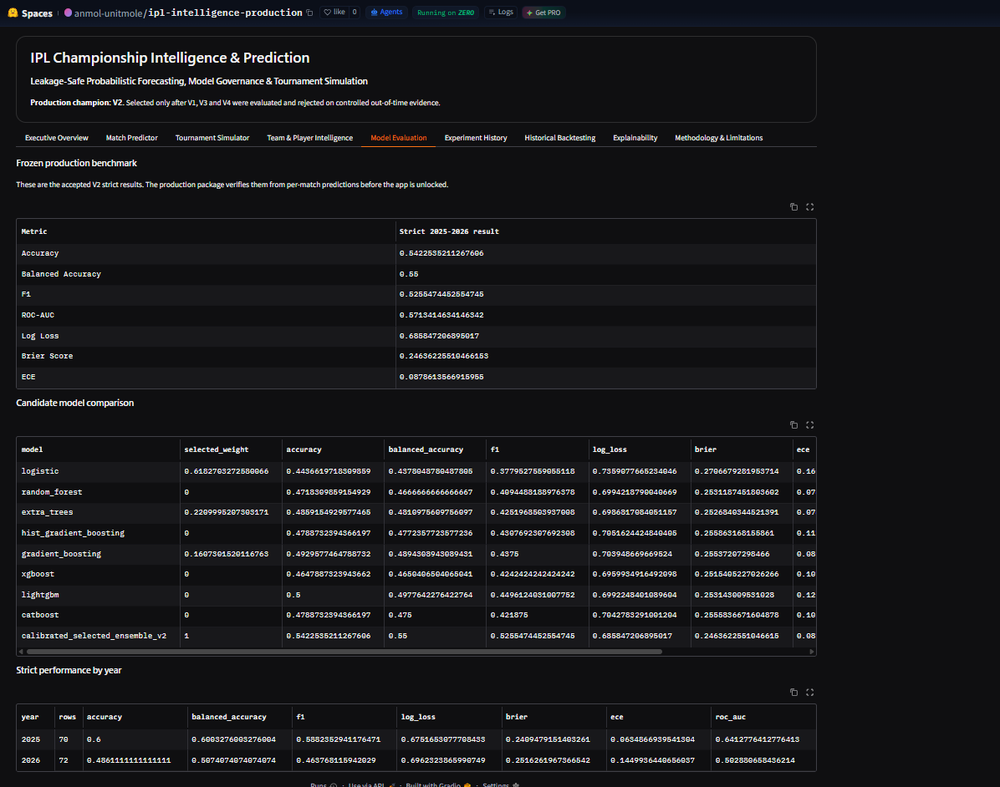
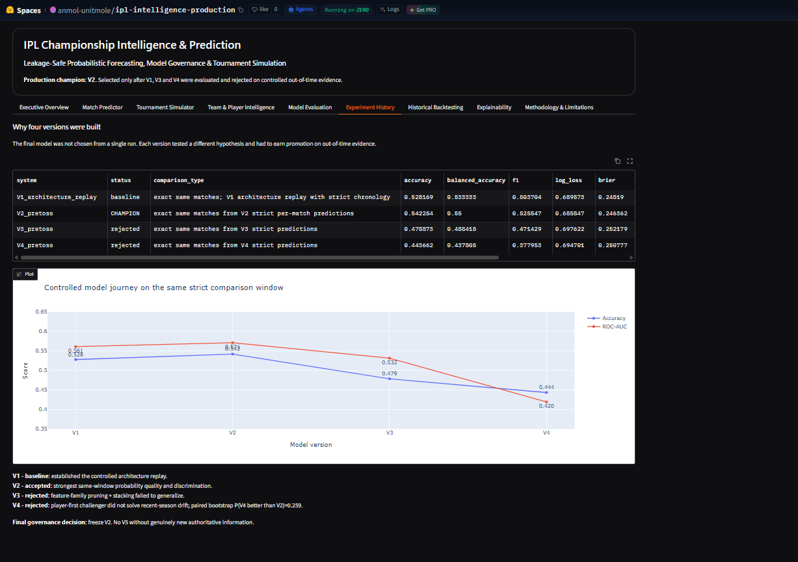
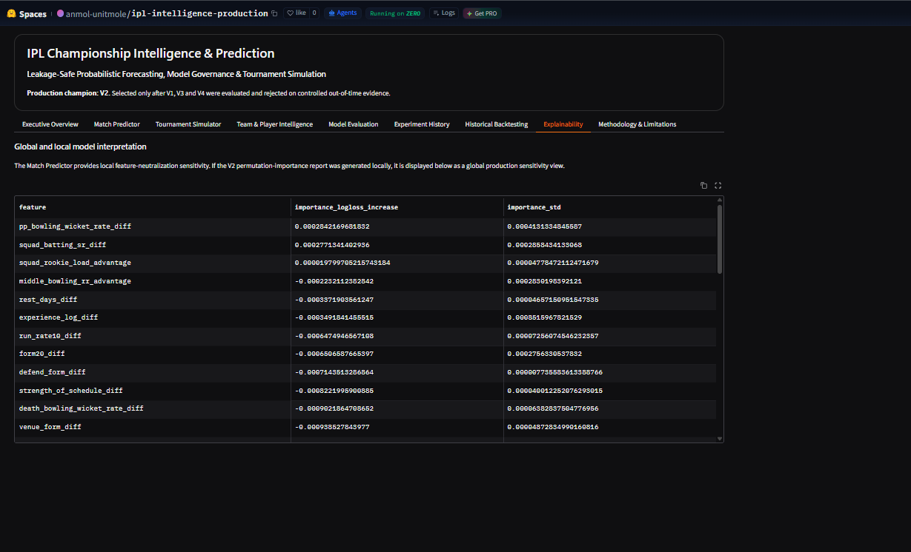

# IPL Championship Intelligence & Prediction

[](https://www.python.org/)
[](https://scikit-learn.org/)
[](https://xgboost.ai/)
[](https://lightgbm.readthedocs.io/)
[](https://catboost.ai/)
[](https://www.gradio.app/)
[](https://huggingface.co/spaces/anmol-unitmole/ipl-intelligence-production)
[](https://github.com/unit-mole/cricket-intelligence-projects/actions/workflows/ipl-tests.yml)
[](LICENSE)

An end-to-end **IPL match intelligence, probabilistic forecasting, model-governance, and tournament-simulation project** built from four controlled modeling iterations. The final production system freezes **Version 2 (V2)** as the champion after V1, V3, and V4 were evaluated on a common strict out-of-time comparison window and rejected when they failed to generalize as well.

**Status:** Portfolio-ready, production package verified, CI validated, and live Hugging Face application deployed  
**Live application:** [Open the IPL Intelligence Production app](https://huggingface.co/spaces/anmol-unitmole/ipl-intelligence-production)  
**Project source:** [Open Project 01 on GitHub](https://github.com/unit-mole/cricket-intelligence-projects/tree/main/01-ipl-intelligence-production)  
**Production champion:** `V2`  
**Strict evaluation window:** IPL `2025-2026`  
**Primary stack:** Python · pandas · NumPy · scikit-learn · XGBoost · LightGBM · CatBoost · Plotly · Gradio · Hugging Face Spaces · GitHub Actions

---

## Responsible Use

This project is intended for technical learning, sports analytics, experimentation, and portfolio demonstration.

- Predictions are probabilistic analytical forecasts, not guarantees.
- The system is not intended for betting, financial wagering, or high-stakes decision-making.
- IPL outcomes are inherently uncertain and can be affected by injuries, toss conditions, tactical changes, player availability, weather, and match-specific events that may not be available to the model.
- The deployed application exposes the frozen V2 production model selected through chronological evaluation.
- Metrics are reported from strict out-of-time testing and are not presented as future certainty.
- Failed V3 and V4 challengers are preserved deliberately to demonstrate model governance rather than hidden or discarded.
- Human judgment is required when interpreting predictions and simulation outputs.

---

## Business Problem

Cricket match outcomes depend on interacting signals such as team strength, recent form, venue context, batting and bowling trends, historical matchups, toss information, and squad composition. A useful forecasting platform should do more than return a winner label.

This project asks:

> Can an IPL forecasting system produce calibrated pre-match win probabilities, survive chronological out-of-time evaluation, reject weaker model iterations, explain the final production choice, and support tournament-level simulation?

The system returns:

- pre-toss win probabilities;
- optional post-toss win probabilities;
- model lean and probability separation;
- team-versus-team comparison;
- tournament simulation;
- historical backtesting;
- model-version comparison;
- feature sensitivity / explainability;
- production-model governance evidence.

---

## Project Objective

Build a professional IPL intelligence system that can:

1. Build a point-in-time IPL match dataset from historical Cricsheet data.
2. Preserve strict chronology so future match information cannot leak into past training rows.
3. Engineer team-strength, Elo, recent-form, phase, matchup, venue, and player/squad context.
4. Compare linear, tree-based, gradient-boosting, and ensemble candidates.
5. Evaluate models using accuracy, balanced accuracy, F1, ROC-AUC, log loss, Brier score, and ECE.
6. Calibrate predicted probabilities.
7. Run expanding-window / chronological backtests.
8. Compare multiple model-development versions on the same strict evaluation window.
9. Reject challengers that do not materially improve probability quality.
10. Freeze the selected champion before production packaging.
11. Provide an interactive Gradio match-prediction interface.
12. Run Monte Carlo-style tournament simulation.
13. Surface historical backtesting and explainability.
14. Validate the repository through automated tests and GitHub Actions.
15. Deploy the final application through Hugging Face Spaces.

---

## Project Pattern

| Item | Implementation |
|---|---|
| Project number | 01 |
| Project name | `01-ipl-intelligence-production` |
| Application | IPL match forecasting + model governance + tournament simulation |
| Production champion | V2 |
| Model iterations evaluated | V1, V2, V3, V4 |
| Strict test window | 2025-2026 |
| Strict test matches | 142 |
| Current IPL match rows | 1,218 |
| Historical coverage | 2008-04-18 to 2026-05-31 |
| Ball-by-ball coverage | 100% |
| Historical lineup coverage | 100% |
| Player-match rows | 27,350 |
| Evaluation | Accuracy, balanced accuracy, F1, ROC-AUC, log loss, Brier, ECE |
| Deployment | Gradio + Hugging Face Spaces |
| CI | GitHub Actions |
| License | MIT |

---

## Dataset

The final modeling pipeline was rebuilt around current structured IPL data rather than the original legacy notebook logic.

### Current validated data snapshot

| Data property | Result |
|---|---:|
| Match rows | 1,218 |
| Date range | 2008-04-18 to 2026-05-31 |
| Teams represented | 15 |
| Duplicate match IDs | 0 |
| Same-team rows | 0 |
| Ball-by-ball match coverage | 100% |
| Historical lineup coverage | 100% |
| Player-match rows | 27,350 |
| Numeric missing cells in final V2 feature table | 0 |
| Validation status | PASS |

### Data-source policy

The production workflow is designed around authoritative or reputable cricket sources and does not intentionally fabricate player, squad, injury, or match data.

The primary structured source used during local rebuilding is Cricsheet IPL data. Raw source archives are not required to be committed to the public Git repository because the production package freezes the validated champion artifacts and benchmark provenance.

---

## Leakage Controls

The project deliberately avoids the leakage pattern found in the original legacy IPL notebook, where full-match outcomes such as total runs and wickets were used to predict the winner of the same match.

The rebuilt system uses:

- point-in-time feature generation;
- chronological training windows;
- temporal model selection;
- separate calibration periods;
- strict future-season testing;
- same-window V1/V2/V3/V4 comparison;
- production refit only after strict metrics were recorded.

The production result is therefore presented as a **pre-match forecasting benchmark**, not an in-match reconstruction task.

---

## Tools and Technologies

| Area | Technology |
|---|---|
| Language | Python 3.12 |
| Data processing | pandas, NumPy |
| Classical ML | scikit-learn |
| Gradient boosting | XGBoost, LightGBM, CatBoost |
| Probability calibration | scikit-learn calibration / production V2 calibration pipeline |
| Visualization | Plotly |
| Application | Gradio |
| Model serialization | Joblib |
| Testing | pytest |
| Automation | GitHub Actions |
| Hosting | Hugging Face Spaces |
| Version control | Git + Git LFS |
| Large model assets | Git LFS |
| Project governance | frozen champion metrics + experiment history + production verification |

---

## End-to-End Workflow

```text
Historical IPL / Cricsheet data
              |
              v
      Data quality validation
              |
              v
 Point-in-time feature generation
              |
              v
 Chronological model development
              |
              v
 Candidate model comparison
              |
              v
 Probability calibration
              |
              v
 Strict out-of-time evaluation
              |
              v
     V1 -> V2 -> V3 -> V4
              |
              v
     Formal acceptance gates
              |
              v
        V2 selected
              |
              v
     Frozen production bundle
              |
              v
 Match prediction + simulation
              |
              v
 Explainability + backtesting
              |
              v
 Gradio + Hugging Face deployment
              |
              v
 GitHub Actions production validation
```

---

## Feature Engineering

The project evolved through several feature architectures. V2 ultimately provided the strongest strict out-of-time performance.

Feature families explored across the project include:

- multi-speed Elo ratings;
- recent team form;
- exponentially weighted form;
- season form;
- head-to-head advantage;
- opponent-adjusted form;
- strength of schedule;
- run-rate trends;
- wickets taken and wickets lost;
- powerplay, middle-over, and death-over performance;
- defending and chasing form;
- venue context;
- toss context;
- batting boundary and dot-ball rates;
- bowling dot-ball rates;
- player-level form proxies;
- squad / lineup context;
- roster continuity;
- player-first team-strength experiments.

Not every feature family was retained in every version. V3 and V4 were intentionally allowed to fail if their new hypotheses did not improve strict future-season performance.

---

## Model Candidates

V2 evaluated a broad candidate set:

1. Logistic Regression
2. Random Forest
3. Extra Trees
4. HistGradientBoosting
5. Gradient Boosting
6. XGBoost
7. LightGBM
8. CatBoost
9. Calibrated validation-weighted ensemble

The final production champion is the calibrated V2 ensemble rather than a single arbitrarily chosen model.

---

## Model Development Journey

Four controlled versions were built and compared.

| Version | Main idea | Accuracy | ROC-AUC | Log Loss | Brier | Decision |
|---|---|---:|---:|---:|---:|---|
| V1 architecture replay | Earlier team-history architecture replayed chronologically | 52.82% | 0.5614 | 0.6896 | 0.2482 | Superseded |
| **V2** | **Richer temporal ensemble + calibration** | **54.23%** | **0.5713** | **0.6858** | **0.2464** | **CHAMPION** |
| V3 | Feature-family selection + stacking | 47.89% | 0.5317 | 0.6976 | 0.2522 | Rejected |
| V4 | Player-first / roster-strength challenger | 44.37% | 0.4195 | 0.6947 | 0.2508 | Rejected |

V2 was selected because it produced the strongest same-window probability quality and classification performance among the four controlled versions.

V3 and V4 were not hidden. Their rejection is part of the project story and demonstrates explicit model governance.

---

## Final Production Metrics

### Strict out-of-time evaluation — IPL 2025-2026

| Metric | V2 result |
|---|---:|
| Accuracy | **54.23%** |
| Balanced Accuracy | **55.00%** |
| F1 Score | **52.55%** |
| ROC-AUC | **0.5713** |
| Log Loss | **0.68585** |
| Brier Score | **0.24636** |
| ECE | **0.08786** |

These numbers are intentionally reported without inflation. IPL forecasting is noisy, and the project prioritizes leakage control, calibration, reproducibility, and honest out-of-time evaluation over headline accuracy.

---

## Why V2 Was Selected

V2 remained the strongest production candidate when all versions were compared on the same strict test matches.

The production decision considered:

- accuracy;
- balanced accuracy;
- F1;
- ROC-AUC;
- log loss;
- Brier score;
- ECE;
- recent-season robustness;
- comparison against Elo;
- same-window comparison against earlier and later model versions.

V4 also included a paired bootstrap comparison against V2. It was rejected, and the project explicitly concluded that no V5 should be created without genuinely new authoritative data.

---

## Calibration and Probability Interpretation

The application returns complementary binary win probabilities.

Example:

```text
Chennai Super Kings: 48.3%
Mumbai Indians:      51.7%
```

The probabilities sum to 100% because the production problem is modeled as a two-team win-probability forecast.

This does **not** mean the model is 100% accurate or certain. It means the system allocates its forecast probability between the two teams under the binary modeling assumption.

---

## Tournament Simulation

The production application includes a tournament-simulation layer that repeatedly samples match outcomes from calibrated match probabilities and aggregates the simulated paths.

Outputs can include:

- expected wins;
- playoff probability;
- final probability;
- championship probability;
- team-by-team simulation table.

The simulator uses probabilistic match outputs rather than deterministic winner labels.

---

## Explainability

The project surfaces model-derived feature sensitivity / permutation-style importance to help users understand which feature differences influence production probabilities.

Examples of evaluated signals include:

- recent form;
- Elo differences;
- wickets taken;
- wickets lost;
- run-rate trends;
- strength of schedule;
- defending and chasing form.

These are model-derived sensitivity signals, not natural-language causal explanations and not hidden chain-of-thought reasoning.

---

## Historical Backtesting

The project includes expanding-window historical evaluation.

The purpose is to measure how the approach behaves when repeatedly trained only on information available before each target season.

This is more realistic than a random train/test split for sports forecasting because it respects time.

Backtesting results are retained under `reports/` for transparency.

---

## Live Hugging Face Application

### Live Application

[](https://huggingface.co/spaces/anmol-unitmole/ipl-intelligence-production)

### Executive Overview



*Production overview showing the frozen V2 champion metrics, model-governance decision, and same-window V1-V4 comparison.*

### Match Predictor



*Interactive pre-toss / post-toss probability forecasting using the frozen calibrated V2 production model.*

### Tournament Simulator



*Probabilistic tournament simulation for playoff, final, and championship scenarios.*

### Model Evaluation



*Production evaluation view covering model quality, calibration-oriented metrics, and strict out-of-time performance.*

### Experiment History



*Controlled V1-V4 development journey showing why V2 was accepted and V3/V4 were rejected.*

### Explainability



*Feature-sensitivity view showing how production probability changes when model inputs are perturbed.*

---

## Application Modules

The deployed Gradio application includes:

| Module | Purpose |
|---|---|
| Executive Overview | Production decision, V2 metrics, V1-V4 comparison |
| Match Predictor | Pre-toss and post-toss match probability generation |
| Tournament Simulator | Repeated probabilistic championship simulation |
| Team & Player Intelligence | Current feature/snapshot context |
| Model Evaluation | Strict evaluation and candidate comparison |
| Experiment History | V1-V4 development and model-governance decisions |
| Historical Backtesting | Expanding-window temporal robustness |
| Explainability | Feature sensitivity / permutation-style interpretation |
| Methodology & Limitations | Evaluation design, intended use, and caveats |

---

## Key Artifacts

| Artifact | Purpose |
|---|---|
| `artifacts/pretoss_model_bundle.joblib` | Frozen V2 pre-toss production bundle |
| `artifacts/posttoss_model_bundle.joblib` | Frozen V2 post-toss production bundle |
| `artifacts/PRODUCTION_ASSET_MANIFEST.json` | Production asset checksums / manifest |
| `artifacts/PRODUCTION_READY.flag` | Production verification gate |
| `reports/FROZEN_CHAMPION_METRICS.json` | Final V2 benchmark |
| `reports/FROZEN_V1_V2_V3_V4_COMPARISON.csv` | Controlled version comparison |
| `reports/strict_test_predictions_pretoss.csv` | Strict pre-toss predictions |
| `reports/strict_test_by_year_pretoss.csv` | Strict season-level results |
| `reports/expanding_window_backtest_pretoss.csv` | Historical expanding-window backtest |
| `reports/model_comparison_pretoss.csv` | Candidate-model comparison |
| `reports/permutation_importance_pretoss.csv` | Explainability / sensitivity data |
| `EXPERIMENT_HISTORY.md` | Full experiment narrative |
| `MODEL_CARD.md` | Model documentation |
| `DEPLOYMENT_GUIDE.md` | Deployment workflow |

---

## Repository Structure

```text
01-ipl-intelligence-production/
|
|-- artifacts/
|-- configs/
|-- data/
|-- deployment/
|-- images/
|-- reports/
|-- scripts/
|-- src/
|-- tests/
|
|-- app.py
|-- README.md
|-- MODEL_CARD.md
|-- EXPERIMENT_HISTORY.md
|-- DEPLOYMENT_GUIDE.md
|-- PROJECT_MANIFEST.json
|-- pyproject.toml
|-- requirements.txt
`-- LICENSE
```

The development-only V1, V2, V3, and V4 working directories are kept outside the public project folder. The public repository contains the final frozen production package plus the metrics and experiment evidence needed to explain the model-selection decision.

---

## Run Locally

Clone the umbrella repository:

```bash
git clone https://github.com/unit-mole/cricket-intelligence-projects.git
cd cricket-intelligence-projects/01-ipl-intelligence-production
```

### Windows setup

```bat
py -3.12 -m venv .venv
.venv\Scripts\activate
python -m pip install --upgrade pip
python -m pip install -r requirements.txt
```

Run the automated tests:

```bat
python -m pytest -q
```

Launch the production application:

```bat
python app.py
```

Then open the local Gradio address printed by the application.

The original packaged Windows workflow also contains helper `.bat` files for environment setup, champion import, production verification, tests, local launch, GitHub release preparation, and Hugging Face bundle preparation.

---

## Production Verification

Before deployment, the production package verifies:

- expected V2 data mode;
- source validation status;
- strict 2025-2026 test window;
- strict row count;
- frozen metric values;
- model bundle loading;
- valid probability ranges;
- prediction symmetry checks;
- production asset checksums.

The public model bundles were copied from the locally validated V2 champion rather than silently retraining a new model after model selection.

---

## Deployment

### GitHub

- Repository: `unit-mole/cricket-intelligence-projects`
- Branch: `main`
- Project folder: `01-ipl-intelligence-production/`
- CI workflow: `.github/workflows/ipl-tests.yml`
- Git LFS: used for production `.joblib` model bundles

### Hugging Face Spaces

- Space: `anmol-unitmole/ipl-intelligence-production`
- Application: Gradio
- Production model: frozen V2 ensemble
- Runtime: Python 3.12
- Public URL: `https://huggingface.co/spaces/anmol-unitmole/ipl-intelligence-production`

---

## Limitations

- Strict out-of-time accuracy is 54.23%, so the project must not be represented as a highly accurate or deterministic match predictor.
- Sports outcomes remain noisy and can change because of information unavailable to the pre-match model.
- Pre-toss forecasting cannot know future toss outcomes or unannounced lineup changes.
- Historical player / squad signals may become stale after roster turnover.
- Venue naming and scheduling context can change across seasons.
- Injury, availability, weather, auction, and official squad information should only be added when authoritative point-in-time data is available.
- The two-team probability setup does not separately model tie / no-result probability.
- Historical backtests show meaningful season-to-season variability.
- Explainability outputs describe model sensitivity, not causal cricket truths.
- The project is a forecasting and portfolio system, not betting advice.

---

## Future Improvements

The modeling phase is intentionally frozen after V4. No V5 is recommended without genuinely new authoritative data.

Future improvements should therefore focus on data quality and production capability rather than repeated score chasing:

- authoritative current squad and playing-XI feeds;
- injury / availability feeds;
- weather and pitch-condition data;
- official player-role metadata;
- richer venue normalization;
- scheduled automated data refresh;
- prediction monitoring after each IPL season;
- calibration-drift tracking;
- structured experiment tracking;
- richer simulation scenarios;
- accessibility and browser integration testing.

A future model revision should be justified by new information, not by repeated tuning against the same strict holdout.

---

## Skills Demonstrated

- Sports analytics
- Probabilistic machine learning
- Time-aware feature engineering
- Elo rating systems
- Chronological validation
- Out-of-time testing
- Model calibration
- Logistic Regression
- Random Forest
- Extra Trees
- Gradient Boosting
- HistGradientBoosting
- XGBoost
- LightGBM
- CatBoost
- Ensemble modeling
- Feature-family ablation
- Model governance
- Acceptance / rejection gates
- Bootstrap comparison
- Historical backtesting
- Monte Carlo tournament simulation
- Feature sensitivity / explainability
- pandas and NumPy
- scikit-learn
- Plotly
- Gradio
- Hugging Face Spaces
- Git LFS
- pytest
- GitHub Actions
- Production model packaging
- Reproducible ML workflows

---

## Portfolio Positioning

**One-line description:** Production-oriented IPL match forecasting and tournament-intelligence platform with leakage-safe temporal modeling, calibrated probabilities, four-version model governance, Monte Carlo simulation, explainability, GitHub Actions, and a live Hugging Face Gradio application.

**Pinned repository description:** Cricket machine-learning portfolio featuring a production IPL probability engine selected through controlled V1-V4 experimentation, strict 2025-2026 out-of-time evaluation, calibrated ensemble modeling, historical backtesting, tournament simulation, explainability, CI, and Hugging Face deployment.

The strongest portfolio story is not a claim of near-perfect IPL prediction. It is the complete engineering and model-governance workflow: build several hypotheses, evaluate them chronologically, reject weaker challengers, freeze the winner, verify the production artifacts, and deploy the same validated model transparently.

---

## Author

**Anmol Tripathi**

Quality Data Scientist building a professional portfolio in Data Science, Machine Learning, Applied AI, Sports Analytics, Predictive Modeling, Probabilistic Forecasting, Analytics Engineering, Full-Stack AI Applications, and Quality Analytics.
