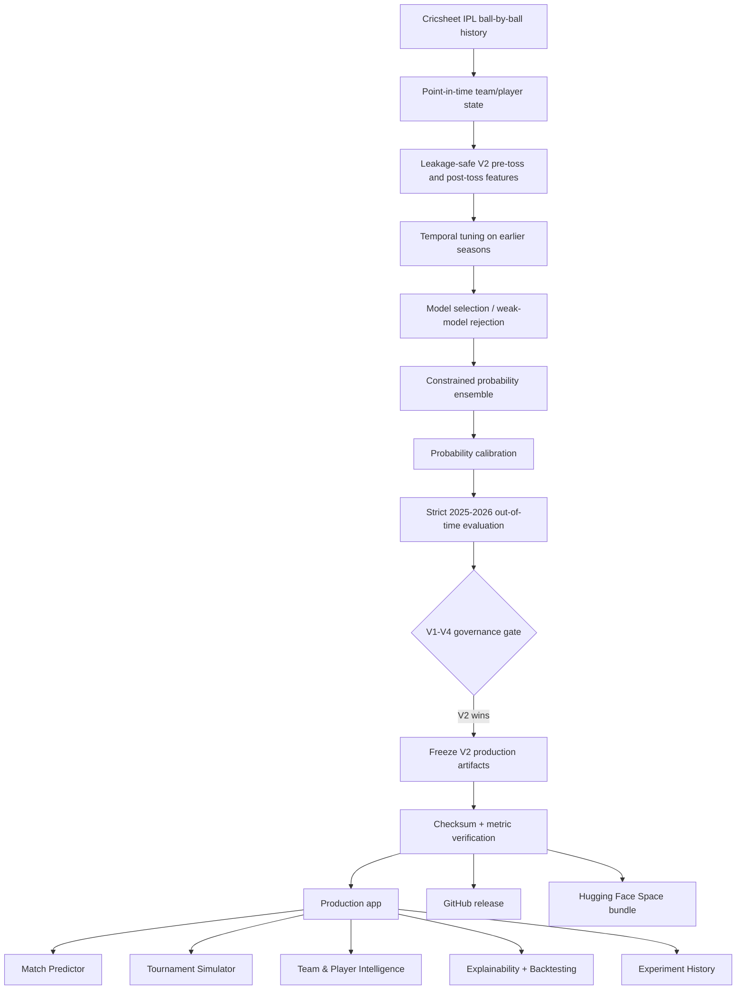

# 🏏 IPL Championship Intelligence & Prediction

## Live Demo

[Launch the IPL Intelligence Production app on Hugging Face Spaces](https://huggingface.co/spaces/anmol-unitmole/ipl-intelligence-production)

**Production-grade, leakage-safe IPL match forecasting and tournament intelligence built around the final V2 champion selected after four controlled model iterations.**

> **Final production model:** IPL Intelligence Lab **V2**  
> **Strict out-of-time window:** 2025–2026 · **142 matches**  
> **Accuracy:** 54.23% · **ROC-AUC:** 0.5713 · **Log Loss:** 0.68585 · **Brier:** 0.24636

This repository is the final production package. It **does not retrain after model selection**. Instead, it imports the already-accepted V2 artifacts from the sibling `IPL_Intelligence_Lab_V2` project, verifies the strict per-match predictions and checksums, and only then unlocks the application and deployment bundle.

---

## Why this project is different

The project did not stop at the first model that produced a plausible score. Four model versions tested different hypotheses under controlled, chronological evaluation. Two later, more complex challengers were **rejected** because they failed to generalize.

| Version | Role | Accuracy | ROC-AUC | Log Loss | Brier | Decision |
|---|---|---:|---:|---:|---:|---|
| V1 architecture replay | Baseline | 52.82% | 0.5614 | 0.68957 | 0.24819 | Superseded |
| **V2** | **Production champion** | **54.23%** | **0.5713** | **0.68585** | **0.24636** | **Accepted** |
| V3 | Feature-selection + stacking challenger | 47.89% | 0.5317 | 0.69762 | 0.25218 | Rejected |
| V4 | Player-first / roster challenger | 44.37% | 0.4195 | 0.69470 | 0.25078 | Rejected |

**V4 paired bootstrap:** `P(V4 better than V2) = 0.259` — not enough evidence to replace V2.

> V1 is explicitly labeled **architecture replay** because its value here comes from the same-window, strict-chronology replay rather than the old notebook's original score.

The final modeling decision is therefore simple: **freeze V2; do not create V5 without genuinely new authoritative data.**

---

## Production architecture



---

## Frozen V2 benchmark

The production package verifies these values by recomputing metrics from V2's strict per-match predictions before it creates `artifacts/PRODUCTION_READY.flag`.

| Metric | Strict 2025–2026 result |
|---|---:|
| Accuracy | **0.5423** |
| Balanced Accuracy | **0.5500** |
| F1 | **0.5255** |
| ROC-AUC | **0.5713** |
| Log Loss | **0.68585** |
| Brier Score | **0.24636** |
| Expected Calibration Error | **0.08786** |

These numbers show **modest predictive signal**, not deterministic forecasting. That distinction is deliberate and central to the project.

---

## Application capabilities

### Match Predictor
- Calibrated **pre-toss** probability as the primary production mode.
- Optional **post-toss** mode with toss decision and announced XI inputs.
- Probability symmetry by construction.
- Model-derived local feature-neutralization sensitivity.

### Tournament Simulator
- Monte Carlo championship simulation using the pre-toss production model.
- Playoff/final/championship probabilities.
- No fabricated future venue or schedule when an official schedule has not been supplied.
- Neutral-venue double-round-robin scenario is explicitly labeled as a scenario.

### Team & Player Intelligence
- Multi-speed Elo state.
- Recent and EWMA form.
- Phase batting/bowling indicators.
- Chase/defend history.
- Player recent-form aggregates from the V2 snapshot.

### Model Evaluation
- Frozen strict metrics.
- Candidate-model comparison from the accepted V2 run.
- Per-year strict evaluation.
- Expanding-window backtesting when the sibling V2 report is available.

### Experiment History
- Full V1 → V4 comparison in the UI and repository.
- Rejected V3/V4 experiments remain visible.
- Governance decisions are stored as machine-readable JSON.

---

## Scientific guardrails

- **No target leakage:** current-match runs/wickets are never used before predicting that historical match.
- **Chronological evaluation:** hyperparameters are tuned only on earlier temporal folds.
- **Weak-model rejection:** candidate models can receive zero ensemble weight.
- **Calibration before strict test:** the calibration choice is made before 2025–2026.
- **Walk-forward strict evaluation:** each strict season is predicted using only information available beforehand.
- **Symmetric probability design:** reversing the team orientation complements the probability.
- **Frozen production decision:** this repository does not tune or retrain after V2 won the model-selection program.
- **Artifact verification:** checksums, data mode, strict row count, frozen metrics and runtime probability symmetry are checked before the app unlocks.
- **Transparent failures:** V3 and V4 are documented rather than hidden.

---

## Local setup on Windows

Keep the production project **next to your already-trained V2 folder**:

```text
D:\AI-Training\Cricket_Intelligence_Projects\
│
├── IPL_Intelligence_Lab
├── IPL_Intelligence_Lab_V2        ← trained champion source
├── IPL_Intelligence_Lab_V3
├── IPL_Intelligence_Lab_V4
└── IPL_Intelligence_Production    ← this repository
```

Run the batch files in this order:

```text
00_SETUP_ENVIRONMENT.bat
CHECK_SYSTEM.bat
01_IMPORT_V2_CHAMPION.bat
02_VERIFY_PRODUCTION_PACKAGE.bat
03_RUN_TESTS.bat
04_LAUNCH_LOCAL_APP.bat
05_PREPARE_GITHUB_RELEASE.bat
06_BUILD_HF_DEPLOYMENT_BUNDLE.bat
```

### What each step does

**`00_SETUP_ENVIRONMENT.bat`** creates a clean `.venv` and installs the production package.  
**`CHECK_SYSTEM.bat`** confirms the local Python/ML stack.  
**`01_IMPORT_V2_CHAMPION.bat`** copies only the accepted V2 production bundles, snapshot and evaluation reports. It first verifies `cricsheet_current_v2` and recomputes the champion metrics.  
**`02_VERIFY_PRODUCTION_PACKAGE.bat`** verifies checksums, strict rows, metadata, runtime prediction sanity and probability symmetry, then creates `PRODUCTION_READY.flag`.  
**`03_RUN_TESTS.bat`** runs the production test suite.  
**`04_LAUNCH_LOCAL_APP.bat`** remains locked until the verification flag exists.  
**`05_PREPARE_GITHUB_RELEASE.bat`** audits file size and creates a GitHub snapshot/checklist. `*.joblib` is configured for Git LFS.  
**`06_BUILD_HF_DEPLOYMENT_BUNDLE.bat`** creates a self-contained Gradio Space under `dist/huggingface_space/` and a ZIP ready for Hugging Face deployment.

---

## Repository structure

```text
IPL_Intelligence_Production/
├── app.py
├── configs/
│   └── production.json
├── artifacts/
│   └── [verified V2 bundles imported locally]
├── data/
│   ├── metadata/
│   └── processed/
│       └── [verified V2 inference snapshot]
├── reports/
│   ├── FROZEN_CHAMPION_METRICS.json
│   ├── FROZEN_V1_V2_V3_V4_COMPARISON.csv
│   ├── EXPERIMENT_DECISIONS.json
│   └── [verified V2 evaluation reports]
├── src/
│   ├── cricket_intel/       # frozen V2 runtime implementation
│   └── ipl_production/      # production governance/runtime layer
├── scripts/
│   ├── import_v2_champion.py
│   ├── verify_production.py
│   ├── prepare_github_release.py
│   └── build_hf_bundle.py
├── deployment/
├── tests/
├── MODEL_CARD.md
├── EXPERIMENT_HISTORY.md
└── DEPLOYMENT_GUIDE.md
```

---

## Reproducibility and provenance

`01_IMPORT_V2_CHAMPION.bat` refuses the production freeze unless the sibling V2 project contains:

- trained pre-toss and post-toss production bundles;
- V2 model metadata;
- `data_validation.json` with `mode = cricsheet_current_v2` and `status = PASS`;
- the exact strict 2025–2026 predictions;
- strict metrics matching the accepted frozen benchmark.

The import then records a SHA-256 checksum for every copied production asset. `02_VERIFY_PRODUCTION_PACKAGE.bat` recomputes those checksums before launch.

This means the GitHub/deployment package is tied to the model that actually won the local experiments rather than a silently retrained variant.

---

## Deployment

The repository includes a dedicated Hugging Face Space builder. After local verification:

```text
06_BUILD_HF_DEPLOYMENT_BUNDLE.bat
```

creates:

```text
dist/huggingface_space/
dist/IPL_Intelligence_HuggingFace_Space.zip
```

See [`DEPLOYMENT_GUIDE.md`](DEPLOYMENT_GUIDE.md) for the final GitHub and Hugging Face publication workflow.

---

## Limitations

The accepted strict window contains only **142 matches**, so very small differences between models should not be overstated. The final ROC-AUC of approximately **0.571** indicates useful but modest ranking signal. IPL match outcomes remain highly stochastic, and the model should be interpreted as a calibrated analytical forecasting system rather than a certainty engine.

The application is **not betting advice**.

---

## Model-development conclusion

The experimentation phase is intentionally closed:

```text
V1  → baseline
V2  → 🏆 accepted production champion
V3  → rejected
V4  → rejected
V5  → not justified without genuinely new authoritative data
```

The next improvements belong to **data quality, product experience, deployment, observability and documentation** — not repeated test-set-driven model iteration.
