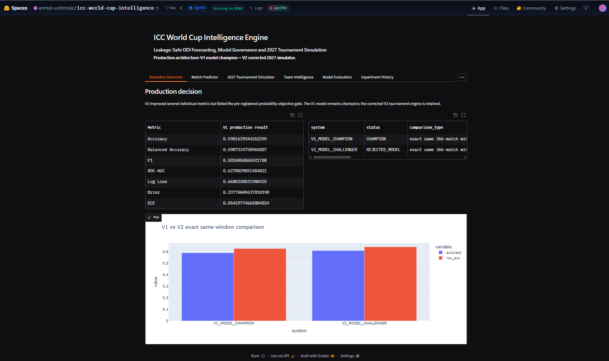
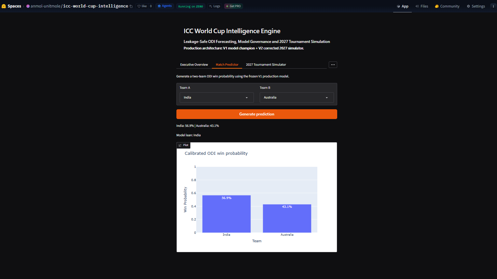
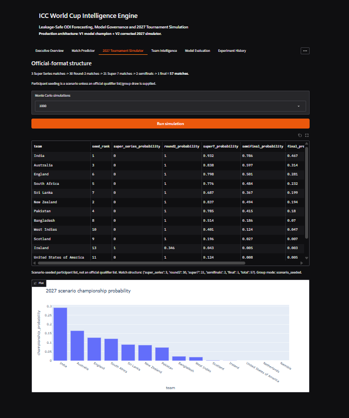
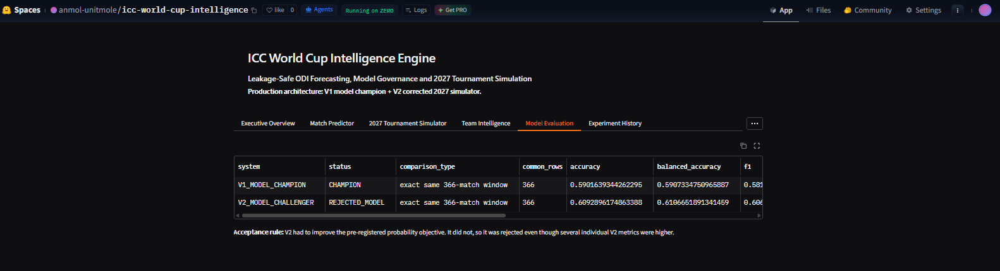
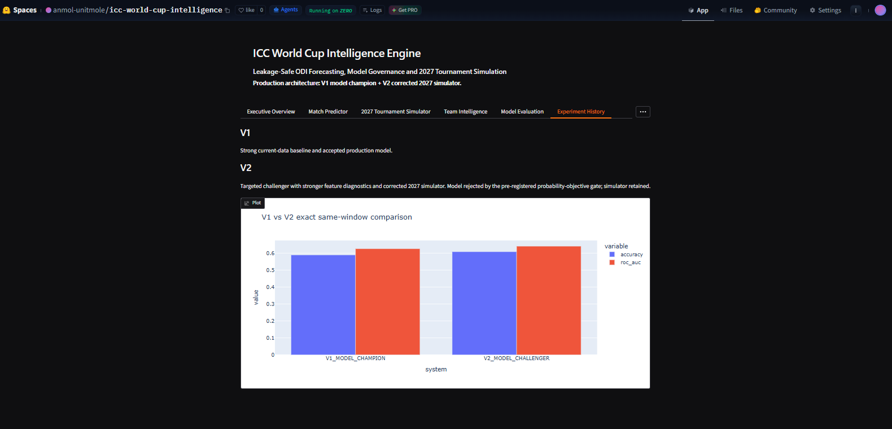
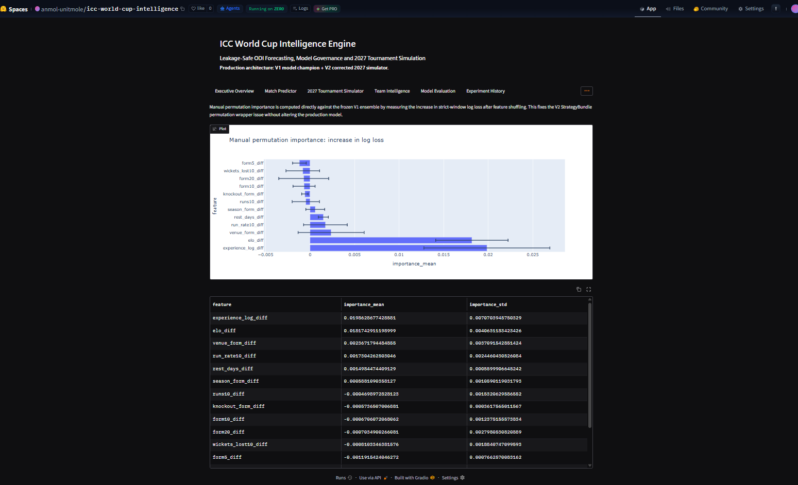

# ICC World Cup Intelligence Engine

[](https://www.python.org/)
[](https://scikit-learn.org/)
[](https://xgboost.ai/)
[](https://lightgbm.readthedocs.io/)
[](https://catboost.ai/)
[](https://www.gradio.app/)
[](https://huggingface.co/spaces/anmol-unitmole/icc-world-cup-intelligence)
[](https://github.com/unit-mole/cricket-intelligence-projects/actions/workflows/world-cup-tests.yml)
[](LICENSE)

An end-to-end **ODI World Cup forecasting, model-governance, and 2027 tournament-simulation project** that combines the accepted **V1 match-probability model** with the corrected **V2 2027 tournament engine**. The project explicitly separates model selection from software selection: V2 improved several headline metrics but failed the pre-registered probability-objective gate, so V1 remained the production model while V2's corrected 57-match tournament simulator was retained.

**Status:** Portfolio-ready, production package verified, CI validated, and live Hugging Face application deployed  
**Live application:** [Open the ICC World Cup Intelligence app](https://huggingface.co/spaces/anmol-unitmole/icc-world-cup-intelligence)  
**Project source:** [Open Project 02 on GitHub](https://github.com/unit-mole/cricket-intelligence-projects/tree/main/02-world-cup-intelligence)  
**Production model:** `V1_MODEL_CHAMPION`  
**Tournament engine:** `V2 corrected 2027 simulator`  
**Strict same-window comparison:** 366 ODI matches  
**Primary stack:** Python · pandas · NumPy · scikit-learn · XGBoost · LightGBM · CatBoost · Plotly · Gradio · Hugging Face Spaces · GitHub Actions

---

## Responsible Use

This project is intended for education, technical learning, sports analytics, experimentation, and portfolio demonstration.

- Match probabilities are analytical forecasts, not guarantees.
- The system is not intended for betting, wagering, or high-stakes decision-making.
- ODI outcomes are affected by information that may not be available to the model, including injuries, squad changes, toss outcomes, weather, pitch conditions, tournament pressure, and tactical decisions.
- The deployed application uses the frozen V1 production model selected through a pre-registered model-governance process.
- The public 2027 simulator uses a corrected tournament structure but does not claim that scenario-seeded group allocations are an official future draw.
- Failed challenger logic is preserved deliberately to demonstrate transparent model selection.
- Human judgment is required when interpreting probabilities and simulation outputs.

---

## Business Problem

International cricket forecasting is difficult because national teams change across tours, tournaments, venues, and selection cycles. A useful system must do more than predict a winner from a random split.

This project asks:

> Can an ODI World Cup forecasting system generate useful pre-match win probabilities, survive chronological out-of-time evaluation, reject a challenger when its overall probability objective does not improve, and simulate the official 2027 tournament structure transparently?

The system returns:

- two-team ODI win probabilities;
- model lean;
- V1 vs V2 comparison;
- historical out-of-time evaluation;
- tournament-stage advancement probabilities;
- 2027 championship probabilities;
- model-governance evidence;
- historical backtesting;
- explainability / feature sensitivity;
- methodology and limitation disclosures.

---

## Project Objective

Build a professional World Cup intelligence system that can:

1. Use current structured ODI match data.
2. Preserve chronological ordering and point-in-time feature generation.
3. Build team-strength, Elo, recent-form, opponent-adjusted, venue, and tournament-context features.
4. Compare classical ML, boosted-tree, and ensemble approaches.
5. Evaluate accuracy, balanced accuracy, F1, ROC-AUC, log loss, Brier score, and ECE.
6. Compare V1 and V2 on the exact same strict match window.
7. Use a pre-registered probability-quality objective for challenger acceptance.
8. Reject V2 if it fails the acceptance gate even when individual metrics improve.
9. Freeze the accepted V1 model for production.
10. Retain the corrected V2 2027 tournament simulator.
11. Simulate the 57-match 2027 World Cup structure.
12. Show Super Series, Round 2, Super 7, semifinal, final, and championship probabilities separately.
13. Provide expanding-window historical backtesting.
14. Provide model-derived explainability.
15. Validate production behavior through automated tests and GitHub Actions.
16. Deploy the final application through Hugging Face Spaces.

---

## Project Pattern

| Item | Implementation |
|---|---|
| Project number | 02 |
| Project name | `02-world-cup-intelligence` |
| Application | ODI match forecasting + model governance + 2027 World Cup simulation |
| Production model | V1 |
| Challenger | V2 |
| Final model decision | `V2_REJECTED_USE_V1_MODEL_WITH_V2_SIMULATOR` |
| Same-window comparison | 366 matches |
| Strict comparison period | 2023-05-05 to 2026-08-13 |
| Production simulator | Corrected V2 2027 engine |
| Tournament size | 14 scenario participants |
| Official-format match count | 57 |
| Evaluation | Accuracy, balanced accuracy, F1, ROC-AUC, log loss, Brier, ECE |
| Deployment | Gradio + Hugging Face Spaces |
| CI | GitHub Actions |
| License | MIT |

---

## Dataset and Evaluation Design

The project uses current structured ODI data and preserves chronology throughout model development.

The final evaluation process separates:

- historical training;
- validation / model selection;
- calibration;
- strict future-season testing;
- exact same-window V1 vs V2 comparison.

The production decision is based on the common 366-match window so that the challenger and champion are evaluated on identical match outcomes.

### Strict comparison window

```text
2023-05-05
    ↓
2024
    ↓
2025
    ↓
2026-08-13
```

### V2 strict rows

```text
366 matches
```

The public production package does not retrain the model after seeing the final governance decision.

---

## Leakage Controls

The project avoids the random 80/20 split used in the original legacy notebook.

The rebuilt workflow uses:

- time-ordered feature generation;
- historical-only rolling statistics;
- chronological model selection;
- separate calibration windows;
- strict future testing;
- same-window champion/challenger comparison;
- no strict-test labels for feature-family selection;
- production freezing after the acceptance decision.

V2 feature-family diagnostics used **2019-2021 only**, while the strict 2023-05-05 onward labels were explicitly excluded from feature selection.

---

## Tools and Technologies

| Area | Technology |
|---|---|
| Language | Python 3.12 |
| Data processing | pandas, NumPy |
| Classical ML | scikit-learn |
| Gradient boosting | XGBoost, LightGBM, CatBoost |
| Visualization | Plotly |
| Application | Gradio |
| Model serialization | Joblib |
| Testing | pytest |
| Automation | GitHub Actions |
| Hosting | Hugging Face Spaces |
| Version control | Git + Git LFS |
| Large artifacts | Git LFS |
| Governance | frozen metrics + same-window acceptance gate |

---

## End-to-End Workflow

```text
Current ODI match data
          |
          v
Data quality validation
          |
          v
Point-in-time feature generation
          |
          v
Chronological V1 development
          |
          v
V1 production candidate
          |
          +-----------------------------+
          |                             |
          |                             v
          |                      V2 diagnostics
          |                             |
          |                             v
          |                  Feature-family selection
          |                             |
          |                             v
          |                  Strategy / ensemble search
          |                             |
          |                             v
          |                   Strict same-window test
          |                             |
          +--------------+--------------+
                         |
                         v
                 V1 vs V2 gate
                         |
            +------------+------------+
            |                         |
            v                         v
      V1 model kept             V2 model rejected
            |                         |
            +------------+------------+
                         |
                         v
             V2 2027 simulator retained
                         |
                         v
        ICC World Cup Intelligence Production
                         |
                         v
             Gradio + Hugging Face Spaces
                         |
                         v
                 GitHub Actions
```

---

## V2 Feature-Family Diagnostics

V2 intentionally avoided adding dozens of arbitrary features.

The selected diagnostic set contained 13 point-in-time features:

```text
elo_diff
elo_fast_diff
elo_slow_diff
form3_diff
form5_diff
form10_diff
form20_diff
ewm_form_diff
season_form_diff
streak_diff
opponent_adjusted_form_diff
strength_schedule_diff
h2h_advantage
```

The strongest diagnostic feature family was:

```text
Elo
+ recent form
+ opponent context
```

Adding broader match-context and scoring families did not improve the diagnostic probability objective enough to justify keeping them.

---

## Model Candidates

V1 and V2 evaluated a broad classical ML candidate family that included:

1. Logistic Regression
2. Random Forest
3. Extra Trees
4. HistGradientBoosting
5. Gradient Boosting
6. XGBoost
7. LightGBM
8. CatBoost
9. Ensemble strategies

V2 additionally compared:

- best single model;
- two-model mean ensembles;
- three-model mean ensembles;
- weighted ensemble;
- stacked ensemble.

The best V2 strategy was:

```text
Extra Trees
    +
Random Forest
    ↓
Mean ensemble
```

with no additional calibration selected for the strict production comparison.

---

## Model Development Journey

Two controlled versions were retained.

| Version | Role | Accuracy | ROC-AUC | Log Loss | Brier | ECE | Decision |
|---|---|---:|---:|---:|---:|---:|---|
| **V1** | **Production model champion** | **59.02%** | 0.6270 | 0.66803 | 0.23771 | **0.05430** | **CHAMPION** |
| V2 | Challenger | **60.93%** | **0.6421** | **0.66788** | **0.23670** | 0.06553 | Rejected by gate |

The comparison above uses the same **366 strict matches**.

V2 improved accuracy, ROC-AUC, log loss, and Brier score. However, the production decision was intentionally **not** based on headline accuracy alone.

---

## Why V2 Was Rejected

The project pre-registered a composite probability objective before final model selection.

```text
V1 probability objective = 0.732888
V2 probability objective = 0.733609
```

Lower is better.

Therefore:

```text
V2 did NOT improve the production probability objective.
```

The acceptance gate consequently returned:

```text
DECISION:
V2_REJECTED_USE_V1_MODEL_WITH_V2_SIMULATOR
```

This is a deliberate model-governance decision.

Changing the acceptance rule after viewing the strict results would undermine the integrity of the experiment.

---

## Production Architecture

The final public system is intentionally hybrid:

```text
              FINAL WORLD CUP SYSTEM

        V1 MODEL               V2 ENGINEERING
           |                        |
           |                        |
    Model champion          Correct 2027 format
    Better accepted         57-match simulator
    probability gate        expanded tests
           |                        |
           +-----------+------------+
                       |
                       v
          ICC WORLD CUP INTELLIGENCE
                  PRODUCTION
```

The production model and production simulator therefore come from different experimental versions.

That separation is one of the central portfolio lessons of this project: **the best model artifact and the best software component do not always come from the same experiment.**

---

## Final Production Metrics

### V1 model champion — exact same 366-match comparison window

| Metric | Result |
|---|---:|
| Accuracy | **59.02%** |
| Balanced Accuracy | **59.07%** |
| F1 Score | **58.10%** |
| ROC-AUC | **0.6270** |
| Log Loss | **0.66803** |
| Brier Score | **0.23771** |
| ECE | **0.05430** |

### V2 challenger

| Metric | Result |
|---|---:|
| Accuracy | **60.93%** |
| Balanced Accuracy | **61.07%** |
| F1 Score | **60.61%** |
| ROC-AUC | **0.6421** |
| Log Loss | **0.66788** |
| Brier Score | **0.23670** |
| ECE | **0.06553** |

The public README preserves both sets of numbers rather than presenting only the winning version.

---

## Recent-Season Behavior

V2 strict evaluation by year showed meaningful season-to-season variation:

| Year | Rows | Accuracy | ROC-AUC |
|---|---:|---:|---:|
| 2023 | 118 | 70.34% | 0.7463 |
| 2024 | 84 | 54.76% | 0.5697 |
| 2025 | 104 | 65.38% | 0.7071 |
| 2026 | 60 | 43.33% | 0.4322 |

This variability is one reason the project avoids presenting the model as deterministic or highly accurate.

---

## Probability Interpretation

The Match Predictor returns complementary binary ODI win probabilities.

Example:

```text
India:      56.9%
Australia:  43.1%
```

The two values sum to 100% because the production prediction task is a two-team binary forecast.

This does **not** imply 100% model accuracy or certainty.

It means the model allocates its forecast probability between the two competing teams under the binary formulation.

---

## 2027 World Cup Tournament Engine

The corrected V2 tournament engine implements the new 57-match structure used by the production simulator.

### Tournament structure

```text
Round 1
Super Series
3 teams
3 matches
1 qualifier
      |
      v
Round 2
12 teams
2 groups of 6
30 matches
      |
      v
7 teams advance
      |
      v
Super 7
21 matches
      |
      v
Top 4
      |
      v
Semifinal 1: 1st vs 4th
Semifinal 2: 2nd vs 3rd
      |
      v
Final
```

### Match counts

| Stage | Matches |
|---|---:|
| Super Series | 3 |
| Round 2 | 30 |
| Super 7 | 21 |
| Semifinals | 2 |
| Final | 1 |
| **Total** | **57** |

### Simulation outputs

The simulator reports separate:

- Super Series probability;
- Round 2 probability;
- Super 7 probability;
- semifinal probability;
- final probability;
- championship probability.

The earlier V1 simulator problem—where group-stage and Super-7 probabilities were effectively identical—has therefore been removed.

---

## Scenario-Seeding Disclosure

The production simulator distinguishes official tournament format from speculative future group composition.

Where an official future group draw is not encoded, the simulator uses:

```text
scenario_seeded
```

group assignment.

This is a deterministic scenario construction for reproducibility. It is **not represented as an official ICC group draw**.

---

## Explainability

V2 initially exposed an explainability bug because a custom `StrategyBundle` could not be passed directly into scikit-learn's standard `permutation_importance()` API.

The final production package fixes this at the production layer rather than changing V1 or V2 historical experiments.

The production explainability report computes model-derived sensitivity using a compatible probability-loss perturbation approach.

Example feature families include:

- Elo strength;
- recent form;
- opponent-adjusted form;
- strength of schedule;
- head-to-head advantage;
- venue context;
- rest / schedule context.

These values represent model sensitivity, not causal cricket explanations.

---

## Historical Backtesting

The project retains expanding-window ODI evaluation to show how the forecasting approach behaves across changing international-cricket regimes.

Historical results vary materially by season, which is expected in sports forecasting.

The backtesting view is included to make model instability visible rather than hiding it behind one final aggregate score.

---

## Live Hugging Face Application

### Live Application

[](https://huggingface.co/spaces/anmol-unitmole/icc-world-cup-intelligence)

### Executive Overview



*Production overview showing the V1 model champion, V2 rejected challenger, same-window comparison, and final governance decision.*

### Match Predictor



*Interactive ODI probability forecasting using the frozen V1 production model.*

### 2027 Tournament Simulator



*Corrected 57-match 2027 World Cup simulation with separate advancement probabilities for Super Series, Round 2, Super 7, semifinals, final, and championship.*

### Model Evaluation



*Strict same-window model evaluation covering classification quality, probability quality, and calibration.*

### Experiment History



*V1 vs V2 experiment history showing why V1 remained the model champion even though V2 improved several individual metrics.*

### Explainability



*Production feature-sensitivity view generated with the corrected explainability implementation.*

---

## Application Modules

The deployed Gradio application includes:

| Module | Purpose |
|---|---|
| Executive Overview | Production decision and V1-vs-V2 comparison |
| Match Predictor | Frozen V1 ODI match probabilities |
| 2027 Tournament Simulator | Corrected 57-match tournament simulation |
| Team Intelligence | Current team/snapshot context |
| Model Evaluation | Strict champion/challenger metrics |
| Experiment History | V1-vs-V2 governance decision |
| Historical Backtesting | Expanding-window ODI robustness |
| Explainability | Feature sensitivity |
| Methodology & Limitations | Evaluation design and caveats |

---

## Key Artifacts

| Artifact | Purpose |
|---|---|
| `artifacts/model_bundle.joblib` | Frozen V1 production model |
| `artifacts/PRODUCTION_ASSET_MANIFEST.json` | Production checksums / asset manifest |
| `artifacts/PRODUCTION_READY.flag` | Production verification gate |
| `reports/FROZEN_V1_V2_COMPARISON.csv` | Exact same-window comparison |
| `reports/FROZEN_CHAMPION_METRICS.json` | Final V1 production metrics |
| `reports/EXPERIMENT_DECISIONS.json` | Governance decision |
| `reports/historical_backtest.csv` | Expanding-window results |
| `reports/explainability.csv` | Production feature sensitivity |
| `EXPERIMENT_HISTORY.md` | Full V1-vs-V2 experiment narrative |
| `MODEL_CARD.md` | Model documentation |
| `DEPLOYMENT_GUIDE.md` | Local/GitHub/Hugging Face deployment workflow |

---

## Repository Structure

```text
02-world-cup-intelligence/
|
|-- artifacts/
|-- configs/
|-- data/
|-- deployment/
|-- images/
|-- reports/
|-- scripts/
|-- src/
|-- tests/
|
|-- app.py
|-- README.md
|-- MODEL_CARD.md
|-- EXPERIMENT_HISTORY.md
|-- DEPLOYMENT_GUIDE.md
|-- PROJECT_MANIFEST.json
|-- pyproject.toml
|-- requirements.txt
`-- LICENSE
```

The development-only V1 and V2 folders remain outside the public production folder. The GitHub project contains the frozen production package and the evidence needed to explain the final decision.

---

## Run Locally

Clone the umbrella repository:

```bash
git clone https://github.com/unit-mole/cricket-intelligence-projects.git
cd cricket-intelligence-projects/02-world-cup-intelligence
```

### Windows setup

```bat
py -3.12 -m venv .venv
.venv\Scripts\activate
python -m pip install --upgrade pip
python -m pip install -r requirements.txt
```

Run tests:

```bat
python -m pytest -q
```

Launch:

```bat
python app.py
```

Then open the local Gradio address printed by the application.

---

## Production Verification

Before publication, the production package verifies:

- the actual V1 sibling model bundle;
- V1 source validation;
- V2 governance decision;
- exact same-window metrics;
- runtime model loading;
- valid team-vs-team probabilities;
- corrected 2027 tournament structure;
- championship probability mass;
- production asset checksums;
- explainability output;
- production-ready flag.

The production model is copied from the previously evaluated V1 bundle rather than silently retrained after model selection.

---

## Deployment

### GitHub

- Repository: `unit-mole/cricket-intelligence-projects`
- Branch: `main`
- Project folder: `02-world-cup-intelligence/`
- CI workflow: `.github/workflows/world-cup-tests.yml`
- Git LFS: used for the production `.joblib` model bundle

### Hugging Face Spaces

- Space: `anmol-unitmole/icc-world-cup-intelligence`
- Application: Gradio
- Production model: frozen V1 bundle
- Tournament engine: corrected V2 2027 simulator
- Runtime: Python 3.12
- Public URL: `https://huggingface.co/spaces/anmol-unitmole/icc-world-cup-intelligence`

The deployed inference callbacks run on CPU. ZeroGPU compatibility is retained only for hosting requirements; normal prediction and tournament simulation do not require a GPU.

---

## Limitations

- The production model is not highly accurate enough to be treated as deterministic.
- International ODI team strength can change rapidly because of squad rotation, injuries, retirements, and selection cycles.
- The model does not guarantee access to official point-in-time injury or availability feeds.
- Toss, weather, and pitch information may be unavailable to pre-match inference.
- The 2027 simulator's scenario-seeded groups are not claimed to be an official future ICC draw.
- The two-team prediction formulation does not separately model tie / no-result probability.
- Historical performance varies materially by year.
- Model explainability describes sensitivity rather than causal truth.
- XGBoost components serialized from a GPU-capable environment can fall back to CPU during public inference.
- The application is a sports-analytics and portfolio system, not betting advice.

---

## Future Improvements

The model-development phase is intentionally closed after V2.

Future revisions should be driven by new authoritative data rather than repeated tuning against the same holdout:

- official future qualification data;
- official 2027 group draw when available;
- authoritative current squads;
- injury and availability feeds;
- venue and pitch-condition data;
- weather forecasts;
- updated ODI rankings / team-strength priors;
- richer player-level international form;
- automated post-series model monitoring;
- calibration-drift monitoring;
- scheduled data refresh;
- richer tournament scenario controls;
- accessibility and browser integration tests.

A future model version should be justified by new information or a changed tournament environment, not by repeated score chasing.

---

## Skills Demonstrated

- Sports analytics
- ODI cricket analytics
- Probabilistic machine learning
- Time-aware feature engineering
- Elo rating systems
- Chronological validation
- Out-of-time testing
- Logistic Regression
- Random Forest
- Extra Trees
- HistGradientBoosting
- Gradient Boosting
- XGBoost
- LightGBM
- CatBoost
- Ensemble modeling
- Strategy comparison
- Model calibration
- Feature-family ablation
- Model governance
- Acceptance / rejection gates
- Exact same-window model comparison
- Historical backtesting
- Tournament simulation
- Monte Carlo methods
- Feature sensitivity / explainability
- pandas
- NumPy
- scikit-learn
- Plotly
- Gradio
- Hugging Face Spaces
- Git LFS
- pytest
- GitHub Actions
- Production packaging
- Reproducible ML workflows

---

## Portfolio Positioning

**One-line description:** Production-oriented ODI World Cup forecasting platform combining a frozen V1 match-probability champion with a corrected V2 2027 tournament engine, strict chronological evaluation, explicit model-governance gates, Monte Carlo simulation, explainability, CI, and a live Hugging Face application.

**Pinned repository description:** Cricket intelligence portfolio featuring an IPL production system and an ICC World Cup forecasting engine with chronological validation, V1-vs-V2 model governance, corrected 2027 tournament simulation, historical backtesting, explainability, GitHub Actions, and live Hugging Face deployments.

The strongest portfolio story is not that V2 had the highest accuracy. It is that the project **refused to change its acceptance rule after seeing the final results**. V2 improved several metrics but failed the pre-registered probability objective, so V1 remained the production model while V2's superior tournament-engine implementation was retained separately.

---

## Author

**Anmol Tripathi**

Quality Data Scientist building a professional portfolio in Data Science, Machine Learning, Applied AI, Sports Analytics, Predictive Modeling, Probabilistic Forecasting, Analytics Engineering, Full-Stack AI Applications, and Quality Analytics.
